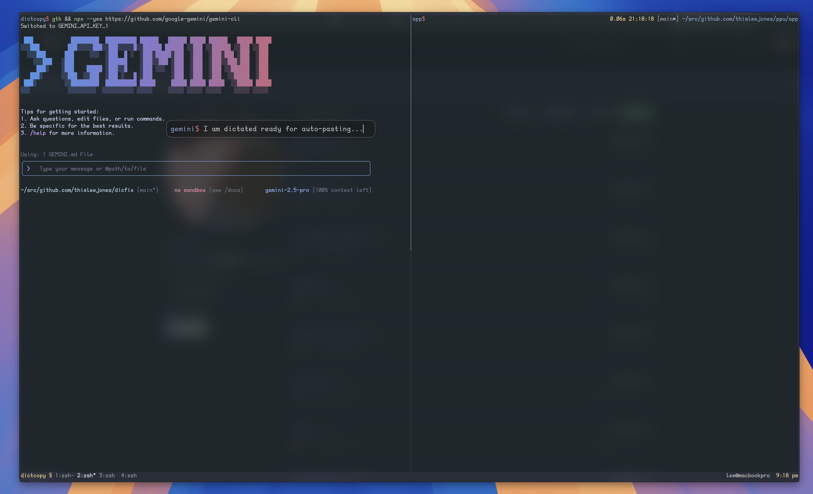

# DicFix

DicFix is a lightweight macOS utility that provides a seamless dictation window for any application, making it perfect for terminals like Alacritty or any other app that lacks native dictation support.

The motivation for this project was to use voice dictation with modern CLI tools, such as AI assistants (Claude, Gemini), where speaking a command or prompt can be more efficient than typing. DicFix bridges this gap by providing a simple, customizable pop-up that captures your speech and sends it to your desired target.

> [!NOTE]
> The main features are stable. The primary remaining task is to enhance hotkey support to include double-tap activation and reserved key combinations, similar to the native macOS dictation settings (see `System Settings > Keyboard > Dictation`).



## Features

-   **Global Dictation**: Use dictation in any application, whether it supports it or not.
-   **Multiple Targets**: Send text to the clipboard, paste it directly, type it out as keystrokes, or print it to standard output.
-   **Seamless Workflow**: The app automatically closes when it loses focus. To send the text, press `Enter`.
-   **Highly Customizable**: Configure the window's appearance, position, fonts, colors, and default target via a simple JSON file.
-   **Command-Line Control**: Override settings and send text directly from the command line for scripting and automation.

## Workflow

1.  **Launch**: Trigger DicFix using a hotkey or by running the app.
2.  **Dictate**: The pop-up window appears. Start speaking.
3.  **Confirm**: When you are finished, press `Enter` to send the text to your target. If you click away, the app will close without sending the text.
4.  **Output**: The app automatically closes, and the transcribed text is sent to your configured target (e.g., clipboard, active application).

## Configuration

DicFix is configured by editing `settings.json`. By default, this file is located at:

`~/Library/Application Support/dicfix/settings.json`

The app will create this file with default values on its first run.

### Custom Configuration Path

You can tell DicFix to use a different location for its configuration directory by using the `defaults` command. This is useful if you prefer to keep all your configuration files in a single place, like `~/.config`.

Run the following command in your terminal, replacing the path with your desired location:

```bash
defaults write io.leejones.dicfix ConfigPath "~/.config/dicfix"
```

The next time you launch DicFix, it will create and read its `settings.json` and `history.txt` from that new directory.

### Example `settings.json`

```json
{
  "windowY": 957,
  "promptBody": "gemini",
  "fontSize": 20,
  "promptPrefix": "›",
  "windowX": 1217,
  "opacity": 0.2,
  "promptPrefixColor": "systemBlue",
  "promptSuffixColor": "#BF616B",
  "windowHeight": 50,
  "fontName": "DaddyTimeMono Nerd Font",
  "promptBodyColor": "labelColor",
  "textColor": "secondaryLabelColor",
  "placeholder": "Speak now...",
  "placeholderColor": "systemGray",
  "promptSuffix": "$ ",
  "windowWidth": 600,
  "target": "paste",
  "dictationKey": "F5",
  "dictationKeyMods": "Command|Shift",
  "dictationKeyDelay": "250ms",
  "pasteDelay": "250ms"
}
```

### Options

-   **`target`**: The default output destination for the text.
    -   `"clipboard"` or `"pasteboard"`: Copies the text to the system clipboard.
    -   `"paste"`: Copies the text and then simulates a `Cmd+V` keystroke to paste it.
    -   `"keystroke"`: Simulates typing the text character by character. (Requires Accessibility permissions).
        > [!WARNING]
        > This feature is currently not functional. Use the `paste` target instead.
    -   `"stdout"`: Prints the text to standard output. This is useful for scripting.
-   **`dictationKey`**: The key used to trigger dictation when the app launches.
    -   See the **Supported Keycodes** section for available values.
-   **`dictationKeyMods`**: A pipe-separated string of modifier keys to be used with `dictationKey`. For example, `"Command|Shift"`.
-   **`dictationKeyDelay`**: The delay before the dictation hotkey is triggered. The duration can be in milliseconds (`100ms`) or seconds (`0.5s`). If no unit is provided, milliseconds are assumed.
-   **`pasteDelay`**: The delay before the paste command is executed when using the `paste` target. The duration format is the same as `dictationKeyDelay`.
-   **Window & Appearance**:
    -   `windowX`, `windowY`: The screen coordinates for the window's top-left corner.
    -   `windowWidth`, `windowHeight`: The dimensions of the window.
    -   `opacity`: The background opacity, from `0.0` (fully transparent) to `1.0` (fully opaque).
-   **Font**:
    -   `fontName`: The name of the font to use.
    -   `fontSize`: The size of the font.
-   **Prompt**:
    -   `promptPrefix`, `promptBody`, `promptSuffix`: The text for each of the three parts of the prompt.
-   **Colors**:
    -   `promptPrefixColor`, `promptBodyColor`, `promptSuffixColor`: The color for each part of the prompt.
    -   `textColor`: The color of the dictated text in the text field.
    -   `placeholder`: The placeholder text to display in the input field when it is empty.
    -   `placeholderColor`: The color of the placeholder text.
    -   **Color Formats**: Colors can be specified using several formats:
        -   **Hex RGB**: `"#BF616B"`
        -   **Named Web Colors**: `"red"`, `"cyan"`, `"magenta"` (lowercase)
        -   **macOS System Colors**: `"systemBlue"`, `"labelColor"`, `"windowBackgroundColor"` (camelCase, matching the system names)

## Command-Line Usage

You can also run DicFix from the command line and override its behavior with arguments.

```bash
# Run with a specific target
dicfix --target stdout

# Override the prompt displayed in the UI
dicfix --prompt "Speak now:"

# Override the dictation key and its modifiers for this run
dicfix --dictation-key "F6" --dictation-key-mods "Command|Shift"
```

> [!NOTE]
> When providing modifiers from the command line, it's important to quote the string (e.g., `"Command|Shift"`) to prevent your shell from interpreting the `|` character as a pipe.

### Arguments

-   `--target <target>`: Overrides the `target` from `settings.json`. Valid targets are `clipboard`, `paste`, `keystroke`, and `stdout`.
-   `--prompt <string>`: Overrides the `promptBody` setting for the current run.
-   `--placeholder <string>`: Overrides the `placeholder` text for the current run.
-   `--placeholder-color <color>`: Overrides the `placeholderColor` for the current run.
-   `--dictation-key <key>`: Overrides the `dictationKey` from `settings.json`.
-   `--dictation-key-mods <modifiers>`: Overrides the modifier keys for the dictation hotkey. Modifiers are pipe-separated, e.g., `"Command|Shift"`.
-   `--dictation-key-delay <duration>`: Overrides the delay before the dictation hotkey is triggered. The duration can be in milliseconds (`100ms`) or seconds (`0.5s`). If no unit is provided, milliseconds are assumed.
-   `--paste-delay <duration>`: Overrides the delay before the paste command is executed. The duration format is the same as `--dictation-key-delay`.

### Supported Keycodes

The `dictationKey` option currently supports function keys `F1` through `F20`.

## Roadmap

- [ ] **VIM Motions**: Implement basic VIM-style navigation and editing within the text field.
    - [ ] **Navigation**: `h` (left), `j` (down), `k` (up), `l` (right)
    - [ ] **Word Movement**: `w` (next word), `b` (previous word)
    - [ ] **Line Movement**: `0` (start of line), `$ (end of line)
    - [ ] **Mode Switching**: `i` (insert mode), `a` (append mode), `esc` (normal mode)
    - [ ] **Editing**: `x` (delete character), `dd` (delete line), `yy` (yank/copy line), `p` (paste)
- [ ] **Configurable Closing Behavior**: Add a `--keep-alive` flag or `--mode` setting to prevent the app from closing on focus loss or after submission, allowing for multiple dictations in one session.
- [ ] **Fix Keystroke Target**: The `keystroke` target is currently non-functional and needs to be repaired.

## Integration with Alacritty

You can launch DicFix from Alacritty using a keybinding. Add the following to your `alacritty.toml` file (usually located at `~/.config/alacritty/alacritty.toml`).

This example binds `Command+Shift-D` to launch the app:

```toml
[keyboard]
bindings = [
  # Add this binding to launch DicFix
  { key = "d", mods = "Command|Shift", command = { program = "/Applications/dicfix.app/Contents/MacOS/dicfix", args = ["--target=paste"] } }
]
```

**Note**: You may need to choose a different keybinding if your preferred combination is already reserved by macOS for a system-wide shortcut (like the default Dictation shortcut).

## Building from Source

This project uses [Tuist](https://tuist.io) to manage the Xcode project generation.

1.  **Install Tuist**: If you don't have Tuist, you can install it easily.
    ```bash
    curl -Ls https://tuist.io/install.sh | bash
    ```

2.  **Clone the repository**:
    ```bash
    git clone https://github.com/thisleejones/dicfix.git
    cd dicfix
    ```

3.  **Generate the Xcode Project**:
    ```bash
    tuist generate
    ```

4.  **Open and Build**:
    -   Open the newly created `dicfix.xcworkspace` file.
    -   Build the project in Xcode (`Cmd+B`).
    -   The compiled `dicfix.app` will be in the `build/Build/Products/Debug/` directory. You can move this to your `/Applications` folder for easy access.

## Command-Line Alias

For convenient command-line use after installing the application, you may want to create an alias for the binary located inside the `.app` bundle.

Add the following line to your shell's configuration file (e.g., `~/.zshrc`, `~/.bash_profile`):

```bash
alias dicfix='/Applications/dicfix.app/Contents/MacOS/dicfix'
```

After adding the alias, restart your terminal or source your configuration file (e.g., `source ~/.zshrc`) for the changes to take effect. You can then run `dicfix` directly from your terminal.

## A Note on the Name

Yes, the name is a bit cheesy. I originally wanted to call it `Chatty`, but the name was taken. Then I considered `Mumble`, but that's a popular voice chat application. So, `DicFix` it is. If you'd like to change it, the project name is defined in `Project.swift` and can be easily updated.
